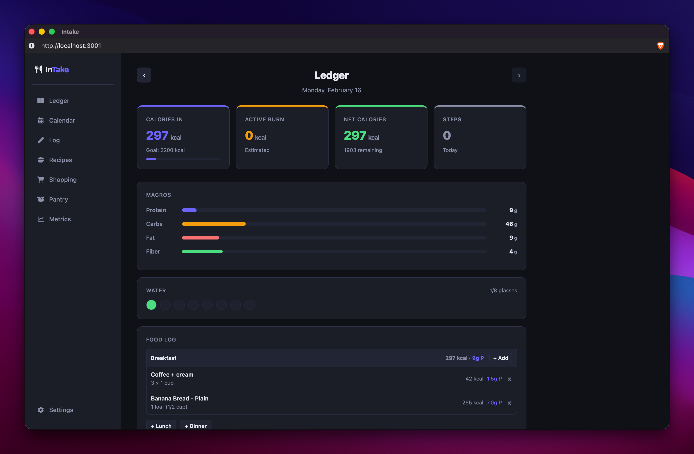
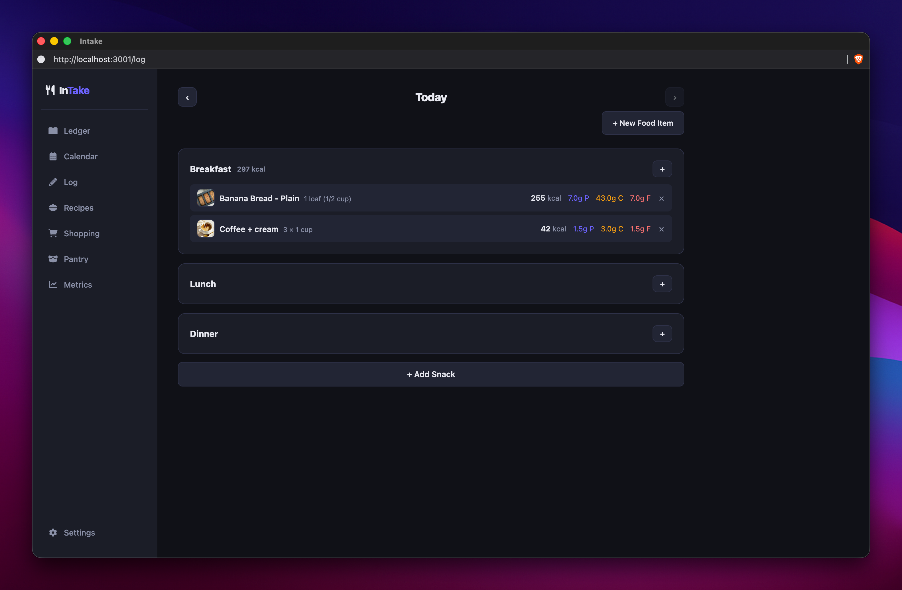
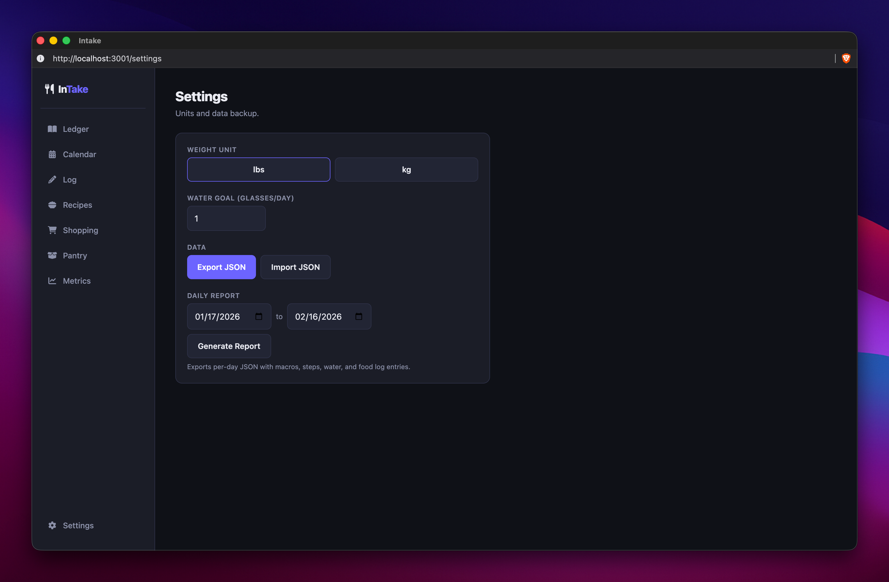
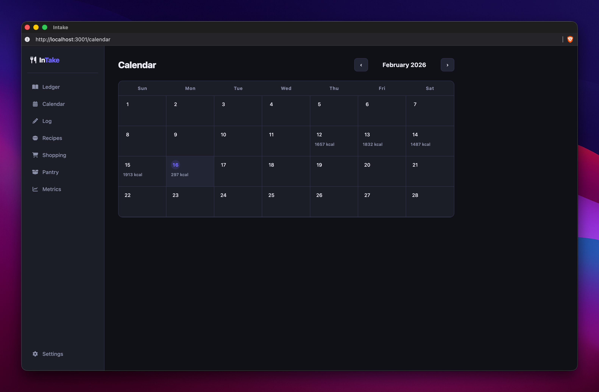
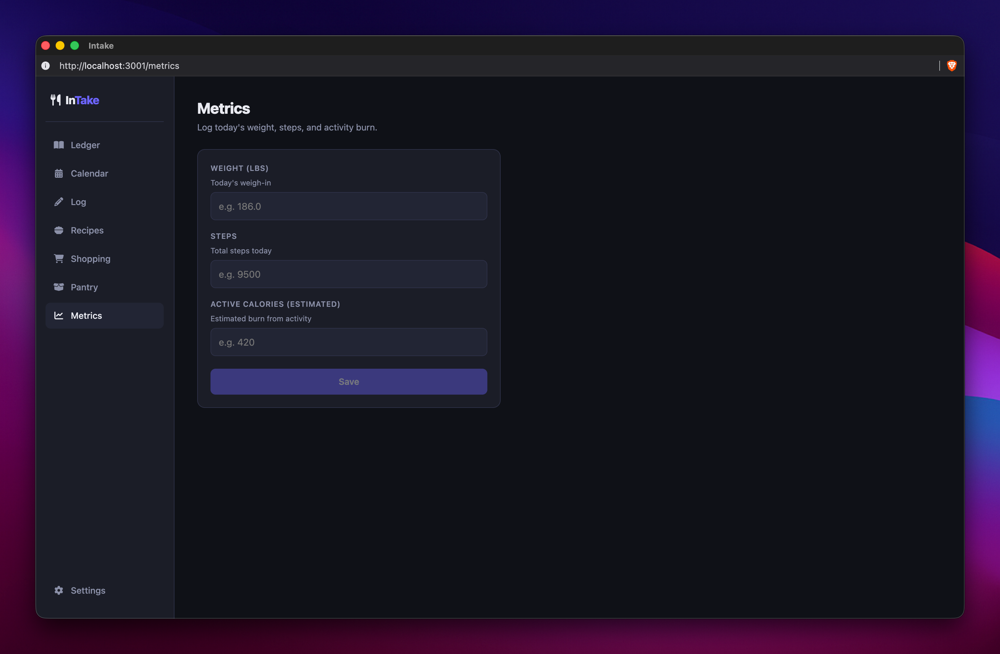

# InTake — Self-Hosted Macro Tracker

A self-hosted nutrition and activity tracker. Log meals, track macros, manage recipes, monitor your pantry, and review trends — all from a clean, fast web UI running entirely on your own hardware.

> **Stack:** Next.js 14 · Go · PostgreSQL 16 · Docker Compose

---

## Quick Start

```bash
# 1. Copy env file and edit as needed
cp .env.example .env

# 2. Build and start
docker compose up --build
```

Open **http://localhost:3001** in your browser.

---

## Features

### Ledger

Daily macro summary with calorie, protein, net-calorie, and step cards. Food log grouped by meal with inline food search and quick-add.




---

### Log

Detailed food logging with per-meal sections, inline food search, and snack slots.




---

### Recipes

Create food items with full macro profiles. Optionally attach recipe instructions (Markdown), categorised ingredients, and a photo.


---

### Pantry

Track food quantities at home. Auto-deducts when you log a meal. Low-stock and out-of-stock indicators with category tab groupings.


---

### Shopping

Select recipes and generate a merged, categorised ingredient list. Check off items as you shop, or export to Markdown.


---

### Calendar

Monthly view of daily calorie totals at a glance.



---

### Metrics

Log body weight (lbs or kg) and daily steps/active calories over time.



---

## Environment Variables

| Variable | Default | Description |
|---|---|---|
| `POSTGRES_DB` | `intake` | Database name |
| `POSTGRES_USER` | `intake` | Database user |
| `POSTGRES_PASSWORD` | `intakepw` | Database password |
| `API_PORT` | `8088` | Host port the API is exposed on |
| `APP_TIMEZONE` | `America/Chicago` | Timezone for date calculations |
| `NEXT_PUBLIC_API_BASE` | `http://localhost:8088` | API base URL (build-time; used as fallback) |
| `NEXT_PUBLIC_APP_TIMEZONE` | `America/Chicago` | Timezone used by the frontend |

---

## Architecture

```
intake/
├── api/
│   ├── cmd/api/main.go       # Go REST API
│   ├── go.mod / go.sum
│   └── Dockerfile
├── web/
│   ├── app/
│   │   ├── page.tsx          # Ledger (main dashboard)
│   │   ├── log/              # Food log page
│   │   ├── recipes/          # Recipe & food item management
│   │   ├── pantry/           # Pantry tracker
│   │   ├── metrics/          # Weight & activity entry
│   │   ├── calendar/         # Monthly calorie calendar
│   │   ├── shopping/         # Shopping list generator
│   │   ├── settings/         # Settings, export, reports
│   │   ├── components/       # Sidebar, WaterTracker
│   │   ├── context/          # WeightUnit context
│   │   └── lib/              # Date utilities
│   ├── package.json
│   └── Dockerfile
├── db/
│   └── init/                 # SQL migrations (run on first boot)
├── docker-compose.yml
└── .env.example
```

| Service | Image | Internal Port | Host Port |
|---|---|---|---|
| `db` | postgres:16-alpine | 5432 | — |
| `api` | Go multi-stage | 8080 | `API_PORT` (8088) |
| `web` | Node 20-alpine | 3000 | 3001 |

The web container proxies all `/api/*` requests to the API internally, so the browser never needs to know the API's host or port.

---

## Authentication

Auth is **not implemented**. The app runs in single-user mode with a hardcoded user ID.

For secure deployments, place a reverse proxy with auth in front (e.g., [Authentik](https://goauthentik.io/), [Authelia](https://www.authelia.com/), Caddy basic auth).

---

## Data Export & Import

In **Settings → Daily Report**, choose a date range and download a per-day JSON summary including macros, water, and food log entries.

Full data export/import (all food items, recipes, log entries, weights, activity) is available via the Settings page or directly through the API.

---

## API Documentation

Full API reference → [https://your-docs-url.example.com](https://your-docs-url.example.com)

---

## Notes

- **Single-user** — no multi-user or auth support built in.
- **Water tracker** — stored in `localStorage`; not synced across devices.
- **Pantry deduction** — fires as a non-blocking background call after logging; silently no-ops if the item isn't in the pantry.
- **No mobile app** — web only, but the UI is mobile-first responsive.
